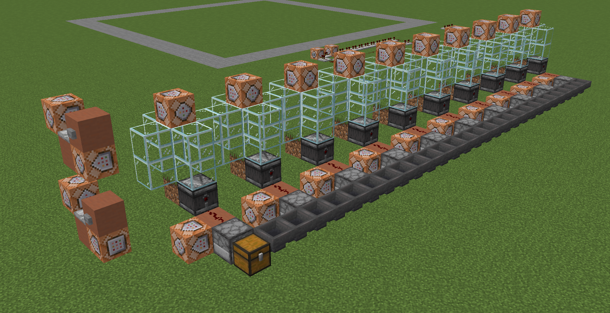
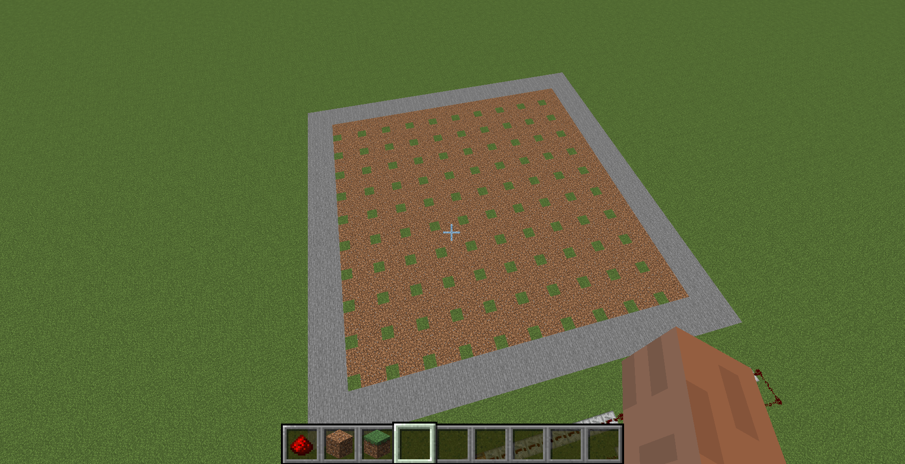
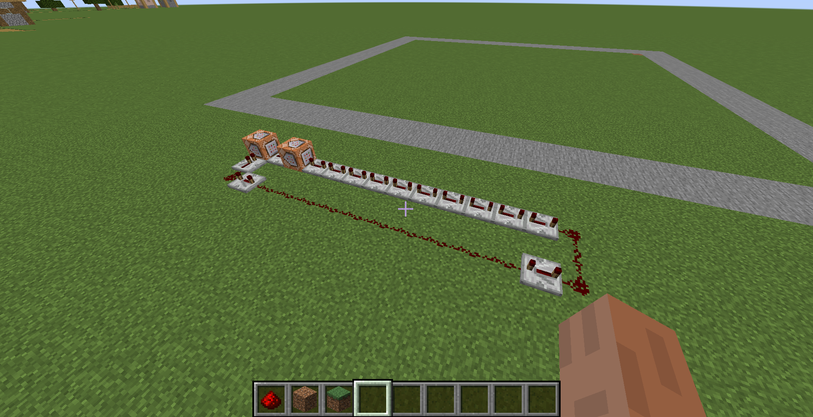

# minecraft_sheep

## Experimental determination of $R$ and $k$
The user-maintained minecraft wiki says that sheep have a 1/1000 chance of attempting to eat on every other tick (a tick being 1/20 of a second). With ten chances per second at a probability of 1/1000, the $R$ value is 0.01. However, no reference is provided for this informatin, so we will be conducting an in-game experiment to determine R.

The grass mechanics are sufficiently complicated that it will also be easier for us to set up an experiment in-game to estimate $k$.

### Sheep eating experiment
Determining $R$ is not terribly difficult. We can simply set a timer and count how many times a sheep eats within that time.

Counting the number of times the sheep eats is done as follows. The sheep is put in a 1x1 block enclosure, standing on a grass block. Facing the grass block is an observer. The observer is connected to a dropper, full of items and facing a chest. When the sheep eats the grass, it turns into dirt, activating the observer and causing an item to be placed in the chest. The number of times the sheep eats is counted by the number of items in the chest.

The observer is also connected to a command block, which is set to place a grass block under the sheep using `/setblock`. When the sheep eats the grass block, turning it into dirt, the command block will immediately replace the dirt with another grass block, ensuring that the sheep is always standing on grass.

Ten of these sheep cells were allowed to run for 1 hour. The experiment was started and stopped using command blocks to `/summon` and `/kill` sheep in all cells simultaneously.

In one hour, the sheep consumed **320** blocks of grass. This gives an $R$ value of 0.00888 m2s-1.

### Grass growth experiment

Determining $k$ is a little more complicated than $R$. The idea with this experiment is to begin with a large area of dirt with uniformly distributed grass blocks, and allow it to spread while recording the grass cover at regular intervals.

The experiment was set up as follows. A 30x30 flat plot of dirt, isolated from any other nearby dirt and grass blocks, was partially covered in grass in this pattern:

One in every 9 blocks is grassy, for a ratio $\frac{N_g}{A}=\frac{1}{9}$.

While the pattern was being setup, `gamerule randomtickspeed` was set to 0, ensuring grass did not spread. To begin the experiment, `randomtickspeed` was set to its default value of 3.

Grass population was tracked using the output of the `/fill` command. When `\fill` is executed, the command output will show how many blocks were changed. A redstone clock with a delay of 5 seconds was connected to two command blocks, containing the following commands:

`/fill -145 -61 96 -174 -61 67 red_wool replace minecraft:grass_block`

`/fill -145 -61 96 -174 -61 67 grass_block replace minecraft:red_wool`

When this clock is run on a loop, the command output will show the number of grass blocks in the pasture every 5 seconds.

For data analysis, see `grass_growth.ipynb`.